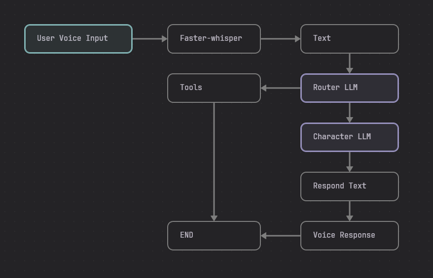

this is a personal project to create a voice directed digital assistant based on the max headroom character.

that being said, I have added a lot of customization, so you can create your own characters, and use it how you would like. 

# SUMMARY

written in python, using langchain, langgraph, etc.

written to work on Windows. Agent and logic will run on linux but some tools are currently windows only.

it currently will respond as an LLM like usual, but also has the following capabilities:

- custom prompt options
- control spotify
- open applications (windows only)
- change the focused (window only)
- set timer
- coming soon:  journalling in markdown, with a save target for obsidian

this is a fun work in progress. if you want to use it and or develop for it be my guest. would love to have more tools designed.

> Note:
>
> 1. this will work with openai or ollama models. you will need to set up the .env for that as well as spotify
> 2. this is designed to pull a custom voice from the [alltalk project](https://github.com/erew123/alltalk_tts), that is how I am cloning max headroom's voice. You can alter or simply not use this, it will currently fallback to pyttsx3 aka a robot voice
> 3. speech-to-text can use google, or faster-whisper. google is currently the default because it requires less set up, but faster-whisper is the better solution.

# INSTALLATION

so basically the steps are pretty simple

1. download the code (clone it or download it and unzip it)
2. install python 3.10 on the system
3. create a virtual environment using `python -m venv .` in the folder/dir of the code
4. activate the environment with `Scripts\activate.bat` on windows or `source bin/activate` on linux
5. run pip install to install all the required modules `pip install -r requirements_windows.txt`
6. then `cp example_env.txt to .env`
7. open that, and put in your info, like openai key or ollama or whatever
8. If you are using an Nvidia GPU and dont already have the CUDA toolkit and such, see note below
9. then run `python main.py` to start the whole thing up

> Note: If you are using faster-whisper and have an nvidia GPU you will need to download the cuda tool kit and cudann to leverage your GPU.
>
> Instructions are [Here](docs/cuda.md)
>
> If this seems too complicated you can just leave it at its default, which will use google for speech-to-text

# Configuration

All of the easy configuration is done in the .env file. This section will explain what the values do, although you will also find it in the [example_env.txt](example_env.txt)

#LLM_TYPE will take openai, local. Local will use Ollama
`LLM_TYPE = 'openai'`

#-----OpenAI variables
`OPENAI_API_KEY = ''`
`OPENAI_MODEL = 'gpt-4o-mini'`

#-----Ollama variables
#OLLAMA_MODEL will take any model you can load in ollama
`OLLAMA_MODEL = 'gemma2'`
`OLLAMA_URL = 'http://localhost:11434'`

#-----Customization Variables
#CHARACTER will take any character prompt you have in the [modules/prompts.py](modules/prompts.py) file. 'max' or 'none' are the default options
`CHARACTER = 'max'`

#LISTEN_MODEL will take whisper or google, whisper is the best option but requires additional setup with Nvidia drivers
`LISTEN_MODEL='google'`

#TIME_LISTEN is the interval in seconds that the mic is running before adjusting for noise level. If you are talking and getting cut off by the mic cycling, you will want to make this longer. If you listen to music a lot you will want it around its default value of 10 seconds

`TIME_LISTEN = '10'`

 #STREAM SPEAK URL is using the default url for Alltalk. If you dont have all talk you can ignore this, if you want to use a different service, simply replace the url `STREAM_SPEAK_URL = 'http://127.0.0.1:7851/api/tts-generate'`

#-----Spotify, if you want Max to be able to control spotify this is where you will put your credentials
`SPOTIFY_CLIENT_ID = ''`
`SPOTIFY_CLIENT_SECRET = ''`
`SPOTIFY_REDIRECT_URI = 'http://localhost:8888/callback'`

# TOOLS

## Spotify

you will need get your spotify credentials in order to have Max control your spotify software.

you can find information on getting that information here: `https://developer.spotify.com/documentation/web-api/concepts/apps`

max can take the following commands: play, pause, stop, next, previous, favorite

> Example: `hey max play spotify`

> Note: you can say really any words that are similiar, max will attempt to read your intent and use the right command

## Window Focus

this tool brings the focus of whatever app you name to the front, it will not open an app

> Example: `hey max show obisidian`

> Note: only works on windows

## Open App

this tool will open an application. when you run max it will create an index of the apps installed on your system

> Example: `hey max open obsidian`

> Note: only works on windows

## Timer

this tool will set a timer with a popup. you tell max to set a time for X time, it will convert it to seconds on the backend and create the timer.

the default timer will have a "clippy" popup, with potentially custom text

> Example: `hey max set timer 2 hours`

# Customization

## Prompt

Max Headroom is the default prompt. If you want to make a custom prompt look in [modules/prompts.py](modules/prompts.py) and add it there. then set the name in .env

When you create a prompt in the prompts.py file the name of the prompt (the variable name) is what you put in the .env file, and it will be the wake word that its listening for.

> Example: you create a new prompt and name it Ted, the new wake phrase is "Hey Ted"

## Alert Phrase/Wake Word

Max is set up for "Hey Max" as the wake word. I didnt love "hey max" as opposed to just "max" but the number of times he got invoked randomly became rediculous. To modify see the above section for custom Prompts.

## Speech

Max has a unique stutter glitch and I recreated this by modifying the voice stream as its being received. If you want to use all-talk with a different model or just dont want glitchiness then comment out `graph.spk.glitch_stream_output(response)` in main.py and uncomment `graph.spk.stream(response)`.

for a custom voice selection look at `modules/speak.py` under the function `stream` and set the voice model there. I will probably make this easier, aka in the .env at some point.

# Process Flow

