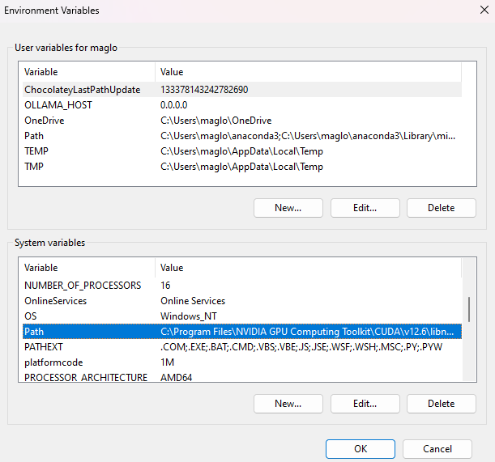

If this seems too complicated you can change Max to use google for speech-to-text instead in the .env

1. download the cuda toolkit: `https://developer.nvidia.com/cuda-downloads`
2. now to get the cudann files we need to get the latest version 8.9.7, which is here: `https://developer.nvidia.com/rdp/cudnn-archive`
3. you will need to create an account with nvidia to get access to the download
4. unzip cudann and copy all of the .dll files
5. paste the .dll files in the toolkit\cuda\bin folder (for example: `C:\Program Files\NVIDIA GPU Computing Toolkit\CUDA\v12.6\bin`)
6. now we need to add those .dll's to your PATH, to do this hit the windows key and type "enviro",
7. select "edit the system environment variables"
8. select button on the bottom right "Environment Variables"
9. in the lower window "System variables" find and select "Path"
   
10. select "Edit"
11. select "Browse"
12. browse to the same location as step 4, where you just put the .dll files
    
13. then select a ok a bunch of times and close out the menu
